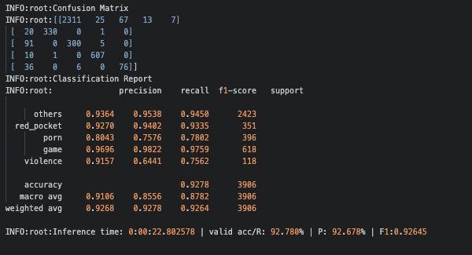

# Classification Engine

### Introduction

A PyTorch version engine for image classification

[reg_engine](./reg_engine): library of this engine

[config](./reg_engine/config): configuration set up for the entire engine

[dataset](./reg_engine/dataset): dataset **Base Class** and auto-augmentation policy

[loss](./reg_engine/loss): categorization loss. e.g. FocalLoss, OHEMLoss, CrossEntropyLoss

[models](./reg_engine/models): modules, models, heads

[optim](./reg_engine/optim): optimizers and learning rate scheduler

[tools](./tools): useful tools for k-fold splitting data/check image validation/convert model to torch.jit.model/test_cfg etc.

### How to use

1. set up your own dataset by refering [my_dataset.py](./my_dataset.py)

2. set up your own configuration by refering [myconfig.yaml](./myconfig.yaml) and [defaults.py](./reg_engine/config/defaults.py)

   ```yaml
   # YAML Example
   DATASET:
     ROOT_PATH: "/data1/zhangziwei/datasets/ads_data/version5/data-content"
     NUM_CLASSES: 5

   MODEL:
     NAME: "resnet18"
     WEIGHTS: ""
     HEAD:
       NAME: ["BasicHead"]
       MODE: "large"
       DROPOUT: 0.2

   # INPUT
   INPUT:
     SIZE: (360, 240)

   # SOLVER
   SOLVER:
     OPTIMIZER:
       NAME: "RAdam"
       LR_START: 4e-3
     LR_SCHEDULER:
       NAME: "MultiStepLR"
     # LOSS: "OHEMLoss"
     LOSS:
       NAME: "LabelSmoothing"
       SMOOTHING: 0.1
     ACCUMULATE_STEPS: 1

   MAX_EPOCH: 20
   NUM_WORKERS: 16
   BATCH_SIZE: 64
   EXTRA: "0327"
   KFOLD: False
   ```

3. Define your own training loop by refering [train.py](./train.py)

   

**Run Model**

```bash
# train model
CUDA_VISIBLE_DEVICES='1' python train.py
# infer model
CUDA_VISIBLE_DEVICES='1' python inference.py
```

### Log & Metrics

**Train**


**Inference**


