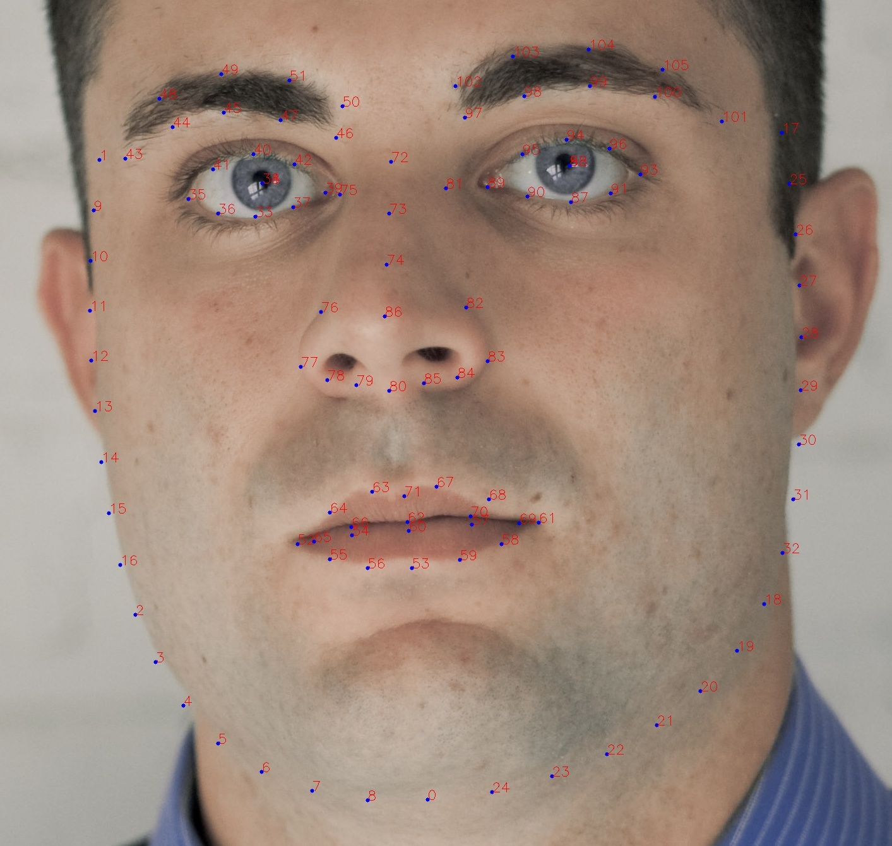

# 1、face_landmark
- ## usage: 
>python face_landmark_from_facepp.py

- ## you can change:
- ### input_dir: images dir to process 
- ### save_dir: dir to save results
- ### attribute_class: different attribute to save
- ### visible_flag: save visible results or not

- ## output: record results in save_dir
- ### each line correspond to one face
> img_path left top width height 106keypoints(x y) pitch yaw roll

- ### example:
> ./test_imgs/9999.jpg 250 401 540 540 511 942 265 450 320 773 338 805 358 836 380 865 405 893 434 918 469 935 261 488 260 525 261 562 266 598 272 634 282 670 292 705 305 739 777 458 719 786 699 817 676 847 650 873 622 899 591 922 554 937 780 496 780 533 779 570 775 607 769 644 760 681 750 717 736 752 382 509 395 485 334 490 354 503 414 507 395 485 443 504 386 468 356 473 418 479 286 434 326 425 368 430 459 456 413 441 323 402 372 403 464 435 419 415 411 770 511 825 460 783 436 797 468 818 563 780 588 793 555 815 511 790 614 764 511 772 487 749 447 758 426 771 462 770 535 748 576 754 598 767 561 767 511 754 514 487 513 542 513 596 476 505 456 621 441 666 463 682 487 688 513 696 551 505 567 619 583 663 562 680 539 686 513 651 651 514 644 485 587 503 617 510 682 505 644 485 703 488 646 465 612 476 679 471 563 452 612 442 659 432 704 427 748 432 558 431 606 416 656 406 707 405 10.125123 0.9791622 -1.3701515

- ### 106 keypoints indexes is show on ./example_face_106.jpg

# 2、hand_gesture
- ## usage: 
>python get_handgesture_from_facepp.py

- ## you can change：
- ### input_dir: images/video dir to process 
- ### save_dir: dir to save results
- ### input_flag: 0-image_dir, 1-video_dir
- ### visible_flag: save visible results or not

- ## output: record results in save_dir
- ### each line correspond to one face
> img_path left top width height hand_gesture_flag

- ### example:
> ./test_imgs/hand/OK1.jpeg 83 61 221 307 5

- ### hand_gesture_flag:
>gesture_dict = {"unknown": 0,
                "heart_a": 1,
                "heart_b": 2,
                "heart_c": 3,
                "heart_d": 4,
                "ok": 5,
                "hand_open": 6,
                "thumb_up": 7,
                "thumb_down": 8,
                "rock": 9,
                "namaste": 10,
                "palm_up": 11,
                "fist": 12,
                "index_finger_up": 13,
                "double_finger_up": 14,
                "victory": 15,
                "big_v": 16,
                "phonecall": 17,
                "beg": 18,
                "thanks": 19}

# 3、body_mask
- ## usage: 
>python get_bodymask_from_facepp.py

- ## you can change：
- ### input_dir: images/video dir to process 
- ### save_dir: dir to save results
- ### merge_flag: save merge results or not

- ## output: record results in save_dir
- ### mask_img.jpg is the segment result
- ### merge_img.jpg is the merge result
